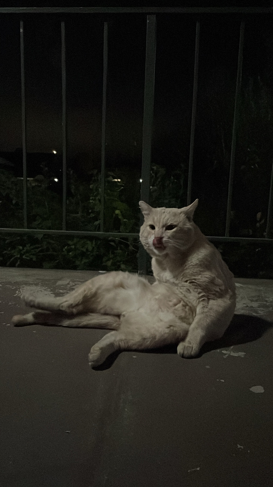

# Introduction

Hello to whoever is reading this.

## Introduction

My name is Andres Hinojosa. I am a first-year master's student at California State University, San Marcos. My major is Computer Science, and I've decided that I wanted to start documenting my journey. 

I'm pretty late on this, since I'm nearing the end of my educational journey. But maybe there's a lot more to come. I can also speak on my past experience. I can even talk about my hobbies which change every 2 days.

Maybe I'm starting this because I feel lonely, as I've currently been living across the country for 34 days out of 63 for a summer internship. Who knows. All I know is that I want to write, despite English being one of my absolute worst subjects. 

Maybe I'm starting this because of just that, I'm a terrible communicator and need to practice delivering my ideas and points in words. I can never find the right words. It's like my vocabulary is a bottleneck.

Here's a picture of Fillibertrum:

  

---

*Written on June 27, 2025*
